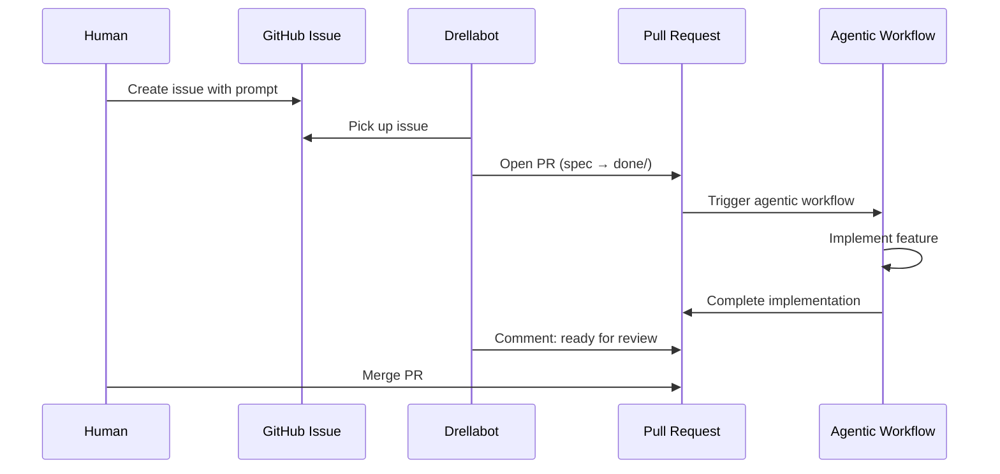
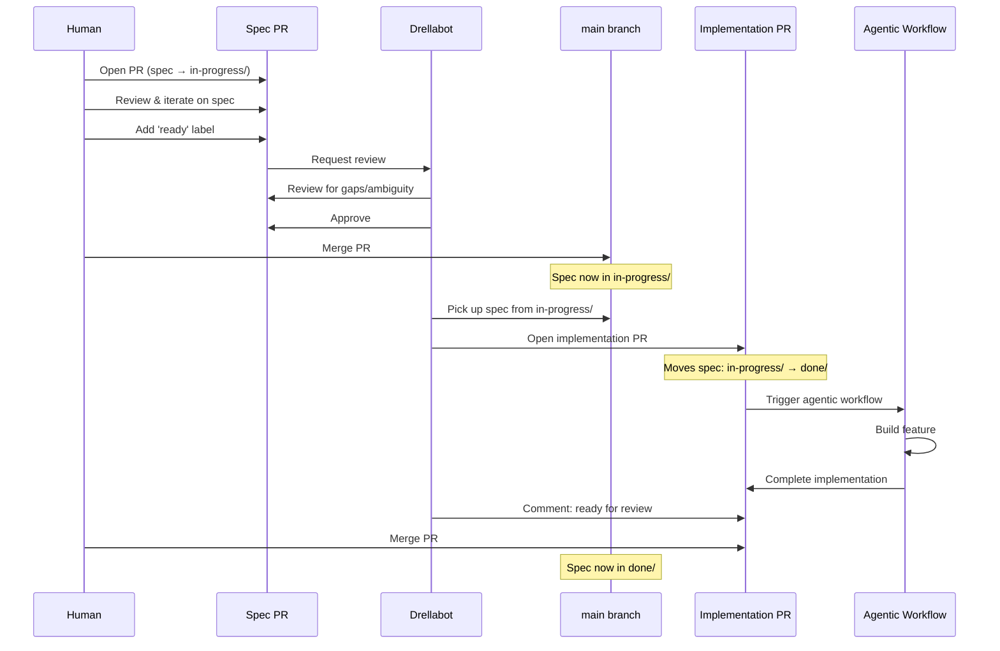

# Tasks for [Drellabot](https://github.com/drellabot/)

This repository is the task backlog and specification store for the Drellabot
lights-out factory. Work enters through one of two tracks depending on
complexity, and an agentic workflow delivers the implementation.

## Simple Tasks - Agent Mode (GitHub Issues)

For work that can be described in a single prompt.

1. A human creates a **GitHub Issue** in this repository with a prompt-style
   description.
2. drellabot picks it up and opens a **pull request** that places the issue
   content as a specification file in `done/`.
3. The open PR kicks off the agentic workflow to deliver on the prompt.
4. As soon as the implementation is complete, drellabot comments on the PR and a
   human merges the PR.

## Detailed Feature Specs - Planning Mode (Markdown in Git)

For features that benefit from a written specification and human review before
implementation begins. Specs move through two folders that represent their
lifecycle:

| Folder | Purpose |
|--------|---------|
| `in-progress/` | Approved specs that are being built |
| `done/` | Delivered — permanent record of completed specs |

1. When a human wants to propose a spec, they open a **pull request** that adds
   the spec file to `in-progress/`.
3. Humans discuss and iterate on the spec in the PR.
4. When the humans agree the spec is complete, they add the **`ready`** label.
5. The `ready` label pulls in **drellabot** as a reviewer. It checks the spec
   for gaps or ambiguity.
6. When drellabot approves, a human **merges** the PR. The spec now lives in
   `in-progress/` on `main`.
7. drellabot picks up specs in `in-progress/` and opens an **implementation
   pull request**, which triggers the agentic workflow that builds out the feature.
8. The implementation PR moves the spec file from `in-progress/` to `done/`,
   keeping a permanent record of delivered specifications.

## Labels

| Label | Used by | Purpose |
|-------|---------|---------|
| `ready` | Humans | Signals that a feature spec has been agreed upon and is ready for drellabot review |

## Writing a Good Spec

Use [`TEMPLATE.md`](TEMPLATE.md) as a starting point. A good spec
includes:

- **Title** — a concise one-liner.
- **Motivation** — why the feature is needed.
- **Proposed Solution** — enough detail for an agentic workflow to implement
  without further clarification.
- **Acceptance Criteria** — concrete, checkable conditions for "done".
- **Open Questions** — unresolved decisions that need human input before work
  begins.
